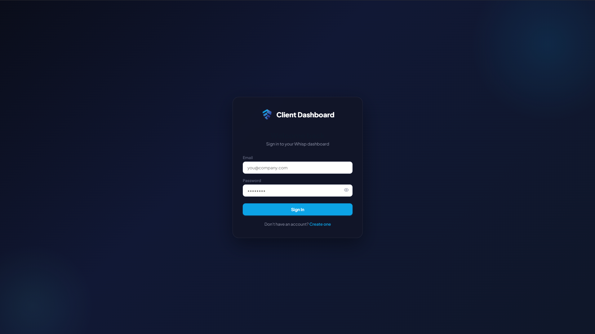
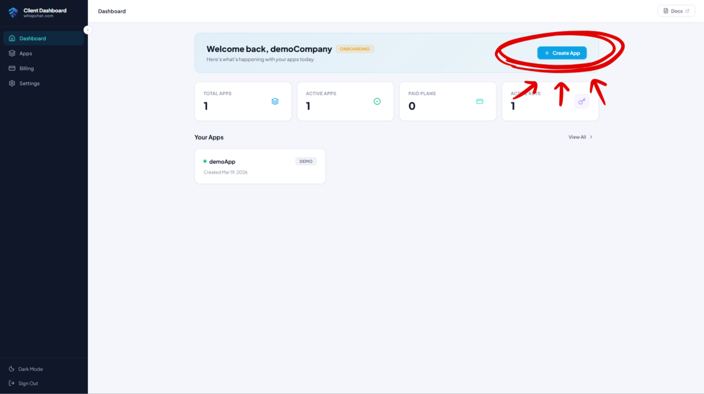
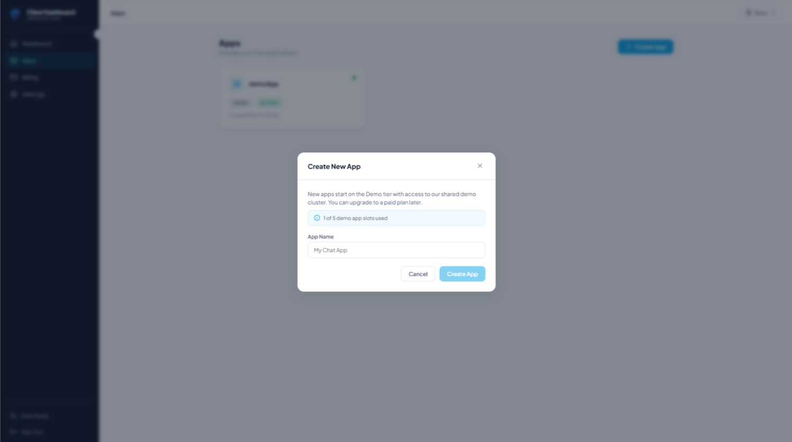
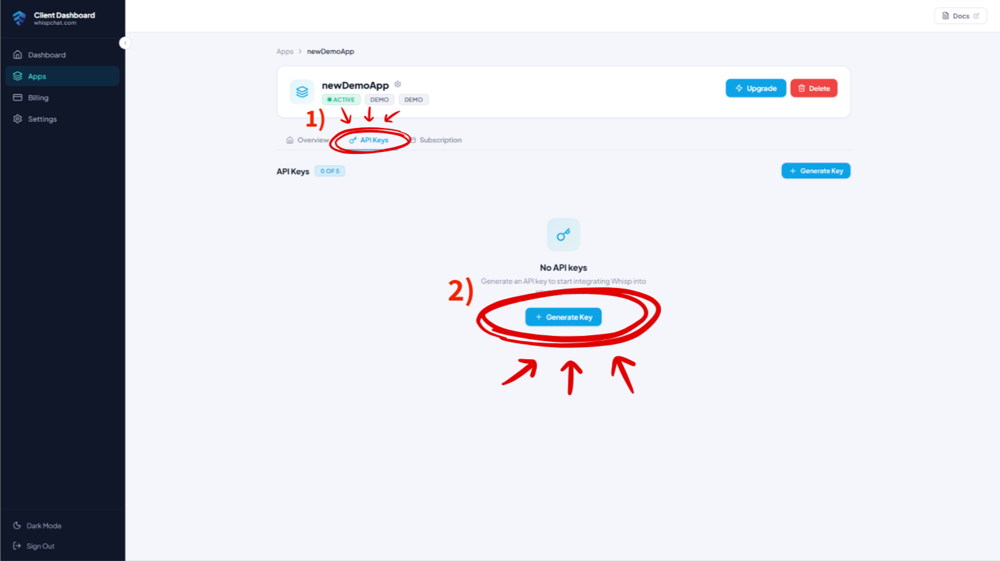
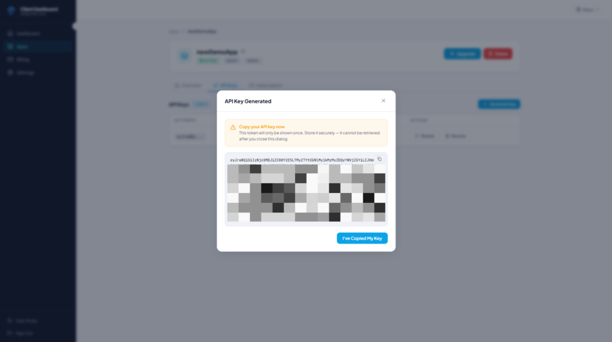
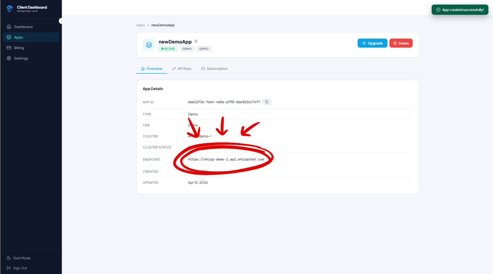

# Getting Started

Welcome to Whisp! This guide walks you through everything you need before writing a single line of code: creating your account, setting up your first app in the Whisp client dashboard, and generating an API key.

If you already have an API key and just want to jump into the code, skip straight to the [JavaScript / TypeScript SDK Overview](/sdks/js).

---

## 1. Create your Whisp account

Head over to **[client.whispchat.com](https://client.whispchat.com)** and sign up. The client dashboard is where you’ll manage everything about your Whisp integration — apps, API keys, usage, and billing.



:::scalar-callout{type="info"}
The Whisp client dashboard is a separate account from any test users you create inside your apps. The dashboard account is *you, the developer*; the app users are *your end users*.
:::

---

## 2. Create your first app

Once you’re signed in you’ll land on the dashboard home screen. Click **“Create app”** to spin up a new app.



An **app** in Whisp represents one product — a website, a mobile app, or any platform that needs chat. A few things worth knowing:

- You can have **up to 5 free (demo) apps** per dashboard account.
- Every user registered with an API key from *App A* is scoped to App A. They cannot see or message users from *App B*. This gives you clean separation between projects, environments (dev/staging/prod), or different products.
- New apps start on the **free demo plan**, which is fully functional but limited in the number of concurrent users. You can upgrade any time to a **multi-tenant paid plan** or **dedicated infrastructure**.



Give your app a name (you can rename it later), confirm, and you’re done.

---

## 3. Generate an API key

Open your newly created app and head to the **API Keys** tab.



Click **“Generate key”** and copy the generated key somewhere safe.



:::scalar-callout{type="warning"}
**The API key is only shown once.** If you lose it, revoke it and generate a new one. Treat it like a password — never commit it to git, never ship it in frontend code.
:::

You can create multiple API keys per app (useful for separating environments or rotating secrets) and you can **revoke any key at any time** from the same screen — revoked keys stop working immediately.

---

## 4. Grab your base URL

Every Whisp **cluster** has its own base URL in the form:

```
https://<clientDomain>.api.whispchat.com
```

A cluster can host multiple apps at the same URL — for example, the shared **demo cluster** (`demo.api.whispchat.com`) serves every free demo app. If you later upgrade to dedicated infrastructure, your apps get their own dedicated cluster URL instead.

You’ll find the exact base URL for your app on its overview page, right next to the API keys section. Copy it — you’ll need it when constructing the SDK client.



---

## 5. Upgrading later

The free demo plan is designed so you can build and test a real integration end-to-end. When you’re ready to go live:

- **Multi-tenant paid plan** — shared infrastructure, removes the demo concurrent-user cap, pay-as-you-grow.
- **Dedicated infrastructure** — your own isolated Whisp cluster with custom SLAs, ideal for enterprise deployments.

You can upgrade any app in-place from the dashboard without losing users, chats, or message history.

---

## Authentication model at a glance

Before you dive into the SDK, here’s the mental model for how auth works in Whisp:

- **Server-only (API key):** `registerUser`, `signIn` — these endpoints require the `x-api-key` header, so they **must** run on your backend.
- **Client (JWT):** every other endpoint uses `Authorization: Bearer <JWT>`. These are safe to call from browsers and mobile apps.
- **Refresh:** JWTs are short-lived; the SDK refreshes them automatically using a long-lived refresh token.

:::scalar-callout{type="info"}
The recommended flow for browser apps is: **your backend authenticates with the API key → forwards the JWT + refreshToken to the browser → the browser calls `whisp.setAuth(...)`**. The browser never sees your API key.
:::

## Real-time messaging

Whisp realtime uses **STOMP over WebSocket (SockJS)** and requires a short-lived **ticket** from `GET /api/auth/getTicket`. You don’t need to worry about any of this — the JS/TS SDK wraps the whole lifecycle behind `whisp.realtime.*`.

## Next steps

- [JS/TS SDK Overview](/sdks/js)
- [Quickstart (Browser)](/sdks/js/quickstart-browser)
- [Quickstart (Node.js)](/sdks/js/quickstart-node)
- [REST API Reference](/api)
